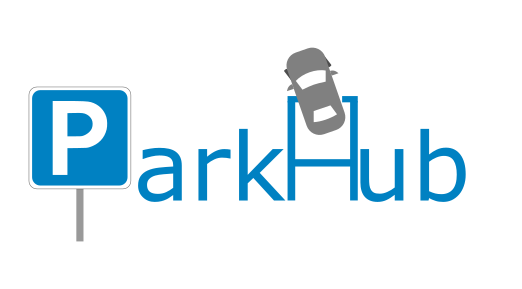

# ParkHub: Park Decisively

[](https://travis-ci.org/joemccann/dillinger)



ParkHub is an innovative eco-friendly technology to make our cities smarter. With Parkhub you will forget about searching for hours for a parking space and you will always be able to find the perfect parking slot for your destination. You will never pay too much for parking again.

Parking search and payment is now more transparent and easier for everyone with a smartphone.

# How it works?

1. **Find a parking space** - Search for the perfect parking space
2. **Park your car** - Simply drive into your preferred car park
3. **And pay** - Pay your parking session with one click in the web

## Features

- A live map that visualizes how many empty parking slots there are in each parking lot
- Basic user authentication system
- Filter parkings by cities and zones
- Easy to user interface


## Future Development

- Expand our app to more parking lots and more cities
- Include the ability to book parking slots for a period of time
- Add option to pay for booking through smart card, account or credit card
- Add GPS on app to guide user through the city to his booked parking slot or if he has not booked a slot to the parking lot of his choice
- Buy monthly parking subscriptions to make parking even easier
- Choose the option that you are interested in certain parking lot - choose at what time range you want to receive notifications about the availability of the places in the parking lot of your choice
- Recommend parkings in a certain radius
- Use the analytics of the availability of the parking data to predict possible crowds to 

## Tech / Stack

- **Java**
- **Vue**
- **Maven**
- **Python**
- **Shell**
- **Hibernate**
- **MySQL**
- **JavaScript**
- **Docker**
- **HTML**

Currently, we mock the data that we will receive from all the sensors with _.py_ scripts. Currently the API is:
```json
{
    "name": null,
    "parkingZones": [
        {
            "zoneIdent": null,
            "parkingSlots": [
                {
                    "slotIdent": null,
                    "dateTimeUpdated": null,
                    "state": 0,
                    "latitude": 0.0,
                    "longitude": 0.0,
                }
            ]
        }
    ]
}
```

# Running on:
```
http://localhost:8080
```

## Installation and Running

Install the dependencies and start ParkHub.

```sh
$ cd backend
$ mvn clean package -Dmaven.test.skip=true
$ cd ..
$ docker-compose up --build -d
$ cd frontend
$ npm install
$ npm run dev
```

### Enjoy!

# Running on:
http://localhost:8080
 
